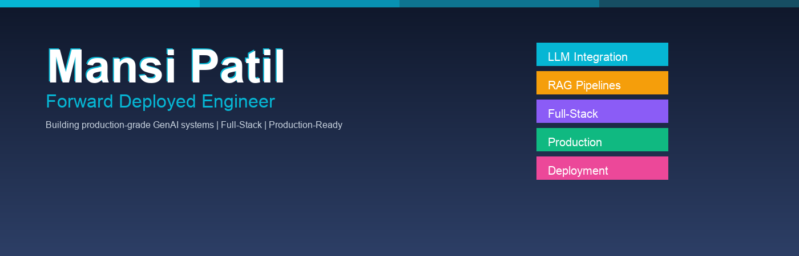

### I work on **machine learning systems that need to hold up in real life**

**Full-stack AI engineering** | Building GenAI products from research to production | Obsessed with reliability

---

## 🎯 What I Work On

| **AI & LLM Systems** | **System Architecture** | **Production & DevOps** |
|---|---|---|
| Multi-model orchestration (Claude, OpenAI, HF) | End-to-end system design (frontend → backend) | CI/CD automation & deployment |
| Production RAG pipelines with vector DBs | High-performance API design | Reliability & monitoring |
| Semantic search & embeddings | Database optimization | Zero-downtime deployments |
| Prompt optimization & cost efficiency | Real-time data pipelines | Infrastructure as code |

**What pulls me in:** Building AI systems that actually scale. Not toy projects—production-grade systems that companies trust with critical workloads.

---

## 💡 Areas of Focus

### AI Integration & GenAI
- Building RAG pipelines and retrieval systems that handle massive data at scale
- LLM integration and prompt optimization for complex reasoning tasks
- Semantic search with embeddings and vector databases
- Multi-model orchestration and cost-efficient inference

### Full-Stack Architecture
- Full-stack AI system design (frontend + API + backend infrastructure)
- API design and optimization for performance
- Database design, caching strategies, and optimization
- Real-time data pipelines and event streaming

### Production & Reliability
- CI/CD pipelines and automated deployments using GitHub Actions
- Performance monitoring, observability, and logging
- Container orchestration with Docker
- Cost optimization and resource management at scale

---

## 🚀 Selected Work

### **Travelmind** — AI Travel Intelligence Agent
**Tech Stack:** Next.js · Groq · Tavily API · Vercel

- Real-time web search with 5 parallel tool calls
- Structured travel briefings in under 10 seconds  
- Production-ready deployment on Vercel
- [Explore on GitHub](https://github.com/Mansi2221/travelmind)

### **Demand Sensing & Inventory Optimization**
**Tech Stack:** Python · Machine Learning · Real-time Analytics

- Advanced forecasting algorithms for demand prediction
- Scalable backend architecture for real-time processing
- End-to-end data pipeline from collection to inference
- [View Repository](https://github.com/Mansi2221/demand-sensing-inventory-optimization)

---

## 🛠️ Tech Stack

**Languages:**  
`TypeScript` `Python` `JavaScript` `SQL`

**Frontend & Mobile:**  
`Next.js 14` `React` `Expo` `Tailwind CSS`

**AI/ML & Data:**  
`Claude API` `OpenAI` `LangChain` `HuggingFace` `Vector Databases` `RAG`

**Backend & Infrastructure:**  
`Node.js` `Supabase` `PostgreSQL` `Python` `Docker`

**DevOps & Deployment:**  
`GitHub Actions` `Vercel` `Docker` `Cloud Deployment` `CI/CD`

---

## ✨ Why Companies Hire Me

✅ **Full-Stack GenAI Expert** — Handle every layer from UX to infrastructure  

✅ **Production Focused** — Every project is reliable, scalable, and optimized for real users

✅ **Proven Track Record** — Shipped multiple production AI systems end-to-end  

✅ **Customer Obsessed** — Build what people actually need, not just features

✅ **Fast Execution** — Ship faster without sacrificing quality or reliability

✅ **System Design Mastery** — Design systems that scale from prototype to millions of users

---

## 📍 Get In Touch

**Available for:** Contract work · Full-time roles · Technical partnerships · Consulting

**Let's discuss:** GenAI products · Startup scaling · System architecture · Production challenges

**💬 [Schedule a Quick Call](https://cal.com)**

**📧 [Email](mailto:mansi@example.com)** · **💼 [LinkedIn](https://linkedin.com)** · **🔗 [GitHub](https://github.com/Mansi2221)**

---

### Building AI products that companies actually use

**GenAI × Full-Stack Engineering × Production Systems**

